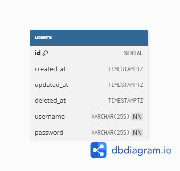

# React and Golang Gin Test

### init postgres database (I use Docker)
 1. `docker pull postgres`
 2. `docker run --name my-postgres -p 5432:5432 -e POSTGRES_PASSWORD=mysecretpassword -d postgres`

### go dependencies install
 1. `cd server`
 2. `go mod tidy`
 3. `go build` then run `server.exe` or `go run main.go`
### react dependencies install
 1. `cd client`
 2. `npm i`
 3. `npm run dev`
### db design
